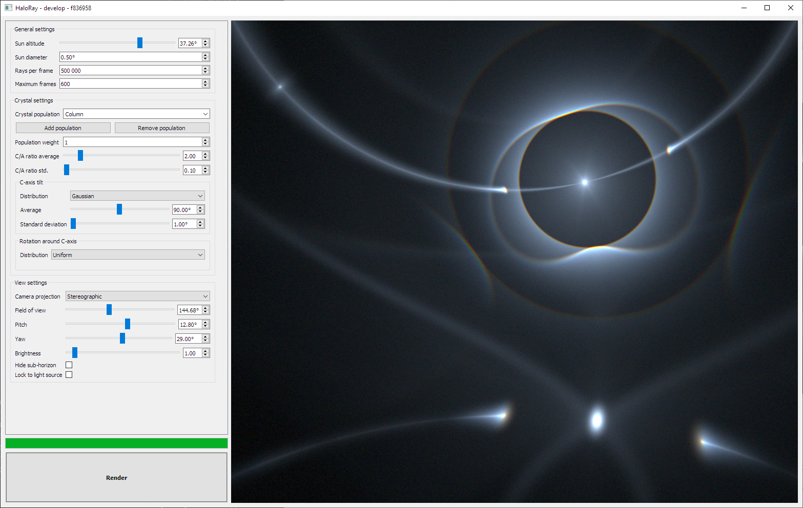

# HaloRay
[](https://ci.appveyor.com/project/naavis/haloray/branch/develop)

HaloRay simulates the reflection and refraction of sun light inside hexagonal
ice crystals present in high altitude clouds in the atmosphere. These ice
crystals produce various optical phenomena in the sky, including bright spots,
circles and arcs.

HaloRay employs GPGPU to massively accelerate simulations. The simulation is
done using OpenGL compute and fragment shaders.

HaloRay currently supports Windows and Linux.



## How to build?

HaloRay requires an OpenGL 4.4 compliant GPU.
The build is done using [CMake](https://cmake.org/).

The user interface is built with [Qt 5](https://www.qt.io/), so you need to
[download the Qt libraries](https://www.qt.io/download-qt-installer) before
compiling HaloRay.

On Linux you can also install Qt using your package manager. On Ubuntu Linux
you can install Qt by running:

```bash
sudo apt-get install qt5-default
```

On Windows you need to set either `Qt5_DIR` or `CMAKE_PREFIX_PATH` environment
variable to point to the Qt prefix path, e.g.
`C:\Qt\5.12.3\msvc2017_64\`

Otherwise CMake won't be able to find the Qt libraries.

Finally build the project by running:

```bash
mkdir build
cd build
cmake ..
cmake --build . --config Release
```

On Windows you need to add the Qt5 binary directory to your PATH environment
variable or copy at least the following Qt DLL files to the same folder as the
resulting executable:

- Qt5Core.dll
- Qt5Widgets.dll
- Qt5Gui.dll

You can also do this automatically with the
[windeployqt](https://doc.qt.io/qt-5/windows-deployment.html) tool, which is
shipped with Qt 5. This is the recommended way.

You can check `scripts\build.ps1` to see how the project is built on the
Appveyor CI server.
